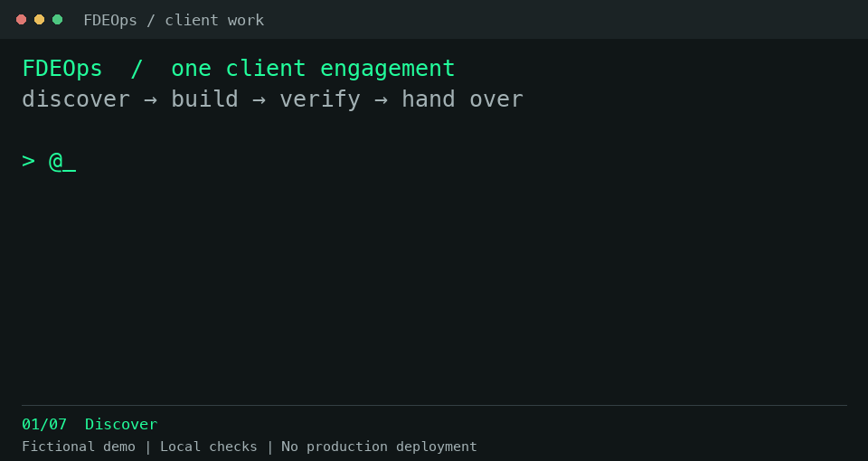

# FDEOps

**Forward deployed engineering skills for your AI coding agent.**

<a name="why-use-it"></a>

The codebase does not tell your agent what the customer agreed to last week, why an approach was rejected or who can approve the next release.

FDEOps brings that context into the work, from the first meeting to a system the customer can run. Use a skill for one task, or let `fde` coordinate the project and keep its record.

**35 task skills + one coordinator, `fde`**. Use your existing tools and processes. You and the customer keep control of the decisions.

[Get started](#quick-start) · [What it helps with](#three-things-it-helps-with) · [Choose a skill](#task-skills) · [Data boundaries](#your-records-your-control) · [Docs](docs/README.md)



*Fictional customers; one workflow. Real local routing code, tests, saved checkpoints and a handover draft. Edited terminal replay; no production deployment. [Read the conversation](media/chat-demo.md) · [View a still](media/chat-demo.png).*

## Quick start

**Use your customer’s approved AI tools and data.** FDEOps runs locally; your AI agent’s settings determine what reaches its provider. Start with synthetic data until customer access is approved. [Safe setup](SECURITY.md#before-customer-work).

### Let `fde` coordinate a customer project

Install in the terminal where your AI coding agent runs, then select your agent:

```bash
npx skills add suboss87/fdeops --skill fde
```

Select `fde` in your agent, or use `@fde` where supported:

```text
@fde this is client01. Their support team reads incoming requests,
checks internal documents, then assigns each request to another team.
Help me prepare for the first meeting. Here is the brief: ...
```

The coordinator selects the right skill as the work changes. For an ongoing project, it keeps decisions, evidence and next actions in a local customer record. You bring the context and make the decisions.

### Use one skill for one task

```bash
npx skills add suboss87/fdeops --skill debrief
```

Then ask your agent:

```text
Use FDEOps debrief to review these meeting notes.
Separate decisions, requests and open questions. Return a draft only.
[Paste notes you are permitted to share.]
```

Each task skill includes the instructions it needs. Use `debrief` on supplied notes without creating a customer record or installing the coordinator.

<details>
<summary>Installation requirements and alternatives</summary>

These installation commands use Node.js and Git; the optional record CLI requires Node.js 18+. See [installation and upgrades](docs/install.md) for host-specific invocation, the full pack and alternatives. Installing `fde` includes all underlying instructions, but does not add the 35 separate task names to your agent's menu.

</details>

**See it in action:** `npx fdeops demo` turns fictional meeting notes into a review and a fieldbook, a browser view of the customer record. No AI model is called. The demo uses Node.js 18+ and Git; `npx` may download the package. It creates or resets its separate `.demo` workspace. [Five-minute walkthrough](docs/USAGE.md#new-here-5-minutes).

## Three things it helps with

### 1. Starting the next session without starting over

A repository tells you where the code lives. It may not tell you why the customer rejected an approach, which access is still blocked or what the team promised on Tuesday.

<a name="keep-a-customer-record"></a>
<a name="how-skills-work"></a>

For ongoing engagements, each customer gets a plain-Markdown record at `~/fde-engagements/<customer>/.fde/`. The coordinator loads a short summary and looks up details as needed. Before resuming implementation, it checks the saved next action against the current task and code.

From the fictional demo’s `fde resume` output:

```text
next: get the reconciliation runbook from Tom before touching anything. [source: meeting 2026-09-10]
do first: Ask the acceptance owner to review the reported result and its evidence (delivery.md: 1 reported result awaiting acceptance)
```

The next session can pick up the work while keeping acceptance pending.

Use [debrief](skills/debrief/SKILL.md) after a meeting and [switch-clients](skills/switch-clients/SKILL.md) when changing customers. [How records work](docs/USAGE.md).

### 2. Keeping a request from becoming an agreement

A stakeholder asks for more scope. A demo looks promising. Neither establishes a new commitment or an accepted result.

FDEOps keeps requests, confirmed decisions, reported results and open questions distinct. You review proposed record changes before saving them. Dates and sources keep claims traceable; customer approval still comes from the agreed owner.

For example, these fictional notes:

> Mara agreed to keep CSV upload this phase. Devon asked for real-time sync; Mara has not answered. Two staging runs took 12 minutes. Production has not been measured.

The review separates them:

| Record | What the notes support |
|---|---|
| Decision | Keep CSV upload this phase; attributed to Mara in the supplied notes |
| Request | Real-time sync remains unapproved |
| Evidence | Two staging runs took 12 minutes; production benefit is unmeasured |
| Next step | Resolve the scope request with Mara before changing the commitment |

This is a draft, not a saved agreement. Use [who-decides](skills/who-decides/SKILL.md), [scope](skills/scope/SKILL.md) or [readout](skills/readout/SKILL.md) for the decision in front of you.

### 3. Knowing what is actually ready

A local test, a deployed change and a customer-accepted result answer different questions.

| Claim | Evidence it needs |
|---|---|
| Implemented | The change exists in the identified revision |
| Verified | Applicable checks passed under stated conditions |
| Deployed | The intended environment is running the change |
| Measured | A result was observed against the agreed measure |
| Accepted | The agreed owner or mechanism accepted the outcome |

The skills use these distinctions when reporting progress; they are not automatic dashboard states.

FDEOps carries agreed checks into implementation and ties test results to the revision and environment checked. Before rollout, it asks for operating limits, recovery evidence and an owner. You can see what is ready, what is blocked and what still needs verification.

Use [build](skills/build/SKILL.md), [integrate](skills/integrate/SKILL.md), [review](skills/review/SKILL.md), [ship](skills/ship/SKILL.md) and [handoff](skills/handoff/SKILL.md) as needed. [See the tests and their limits](docs/verification.md).

## Choose a skill

<a name="task-skills"></a>

| Work in front of you | Start with |
|---|---|
| An unclear customer request | `brief`, `discover` |
| Unclear ownership or access | `who-decides`, `earn-trust` |
| A decision about scope or approach | `scope`, `options`, `plan` |
| An implementation or system connection | `build`, `integrate` |
| A failure or a result to verify | `debug`, `review`, `qa`, `evaluate` |
| A release or operating handover | `ship`, `runbook`, `handoff` |
| Meeting notes or a customer update | `debrief`, `readout` |

Start with the task you need, or let `fde` select it. `dashboard` works with saved records; `debrief` can review supplied notes and return a draft. Each skill explains the context it needs. [Full skill catalog](docs/skills-reference.md).

<a name="what-a-working-day-looks-like"></a>

<details>
<summary><strong>View your customer records in the fieldbook</strong></summary>

The fieldbook is a read-only browser view of next actions, risks, evidence gaps and results awaiting acceptance.


```bash
npx fdeops dashboard --all --open
```

Copy an action into your agent to continue. Regenerate the view after record updates. [Daily use](docs/USAGE.md).

</details>

<a name="your-records-your-control"></a>
<a name="your-data-stays-yours"></a>

## Local records, explicit data boundaries

The CLI reads local files and Git without network calls or telemetry. Installation may download packages. Your AI host controls model connections and may transmit what it reads.

CLI and hook outputs mask common identifier patterns. `<private>` blocks are redacted from those outputs and the dashboard. Local reports retain unmarked identifiers by default. These filters cover FDEOps output, not raw files or text you paste into an agent. Use only approved material, including when anonymised.

You review consequential record updates. Enabled hooks can save mechanical session progress; direct CLI write commands update records when run. [Privacy](PRIVACY.md) · [Security](SECURITY.md) · [Local-model results](docs/verification.md#local-model-results).

## Who this is for

Forward deployed engineers, consultants and delivery teams working across customer meetings, codebases and operating environments. Bring your existing tools, access and customer agreements. Start with one task or use `fde` throughout the engagement.

## Go deeper

[Install or upgrade](docs/install.md) · [Daily use](docs/USAGE.md) · [Worked examples](examples/) · [Skill catalog](docs/skills-reference.md) · [Source connections](mcp/recipes/) · [Repository layout](docs/REPO_LAYOUT.md) · [Verification](docs/verification.md) · [Contribute](CONTRIBUTING.md)

Built and maintained by [Subash Natarajan](https://www.linkedin.com/in/subashn/). [Issues](https://github.com/suboss87/fdeops/issues) · [Discussions](https://github.com/suboss87/fdeops/discussions).

## License

[MIT](LICENSE). Use FDEOps in your customer work.
